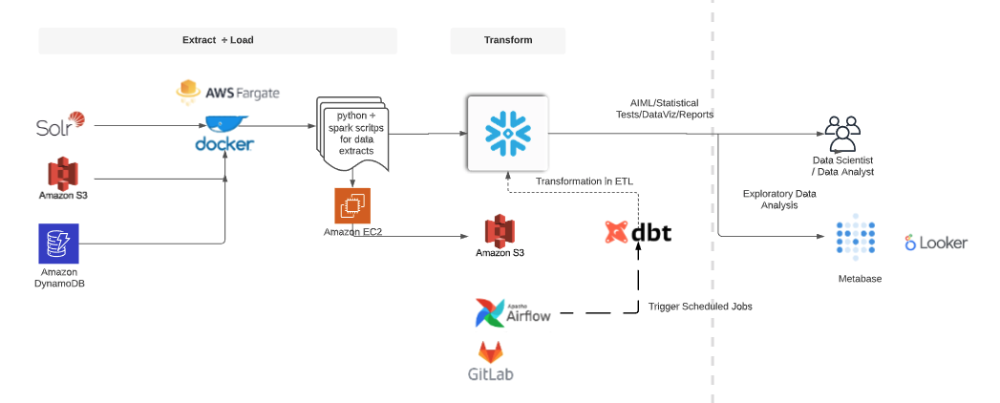
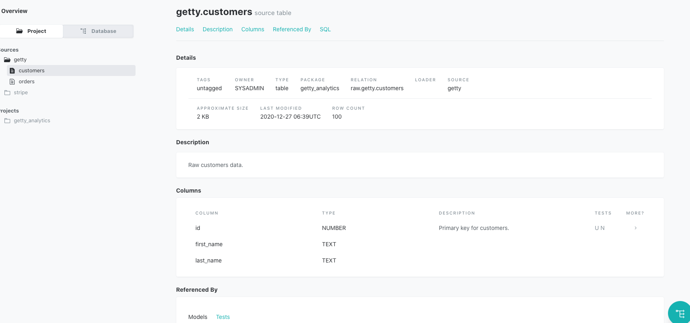
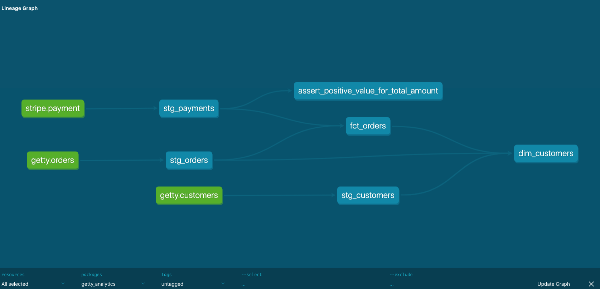

## LTR Output Data Service 

## Overview 
LTR Output Data Service  is a repository for data pipelines that manages various scheduled workflow. 
Currently scheduling can be done in two ways: dbt cloud serive (paid) or a combination of Gitlab CI and Airflow  have only handful of jobs defined. 

The data product in snowflake db contains four layers 
- raw (raw data)
- staging (cleansed data and validated data)
- data_library (dims, facts, aggregates, marts or other business logic)
- analytics (single source of truth data for DS/DA/BI)

Architecture of the current pipeline is seen below.  




### Deployment
Temporary, the deployment has to be done manually using a script for the on-prem solution. Cloud solution would incolve licencing but could provide automated deployment. 
Plan is to automate the deployment steps. when the code changes are merged in develop, dags will be deployed in staging
environment and when the code gets merged in master branch, the changes will be deployed in production.
### Running DBT job on your local for development
1. Activate python
    ```shell script
    cd $PROJECT_HOME
    source venv/bin/activate
    ```

2. Run dbt deps, seed, compile, and test
```shell script
dbt compile # compile your models
dbt test    # run tests
```

3. Deploy changes to your dev target warehouse
```shell script
dbt run     # apply the models to your target dev data warehouse
```

4. If you want to apply only the model you changed, run:
```shell script
dbt run --models {my_package}.{some_model}
dbt run --models tags:tagname

# for example, you can run:
dbt run --models staging.stg_customers
dbt run --models tags:daily
```
5. If you want to generate documentation of your models, run:
```shell script
dbt docs generate #for on premise go to the web UI to see the doc
```
documentation includes metadata, description, tests and so on and would look like this 


the user can also see the lineage of the entire model or each table (see below)



##TODO
- add dbt seed to create tables from feeds (csv files in data directory) 
